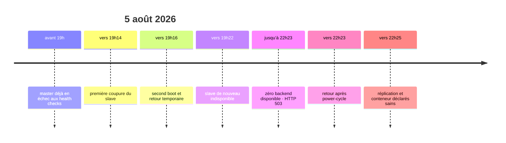
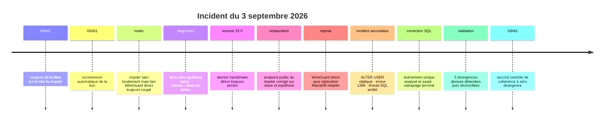

# Historique, décisions d'architecture et REX

[← Incidents / PRA](05-incidents-et-pra.md) · [README](../README.md) · [Axes d'amélioration →](07-axes-d-amelioration.md)

Cette page conserve **le pourquoi** derrière l'infrastructure. Elle rassemble la
chronologie, les décisions structurantes et les retours d'expérience. Contrairement
aux runbooks, elle n'est pas conçue pour être suivie ligne par ligne pendant une
panne : elle sert à comprendre les compromis, les erreurs passées et les raisons des
choix actuels.

Les décisions sont conservées au format ADR (`Contexte → Décision → Conséquences →
Alternatives`) mais réunies dans un même document pour éviter la multiplication de
petits fichiers.

Les adresses IPv4 et IPv6 publiques réelles sont volontairement absentes de cette
documentation. Les exemples utilisent des placeholders tels que
`<préfixe IPv6 actuel>::10`.

## Chronologie du projet

| Date               | Événement                                                                                    | Résultat                                                                 |
| ------------------ | -------------------------------------------------------------------------------------------- | ------------------------------------------------------------------------ |
| avant juillet 2026 | migration historique SQLite vers MariaDB et mise en place de la réplication bidirectionnelle | schémas hérités et anciens fichiers SQLite conservés                     |
| 15 juillet 2026    | incident fournisseur et premier reboot d’`equilihost`                                        | WireGuard remonté manuellement puis unité activée au démarrage           |
| juillet 2026       | mise à jour Vaultwarden 1.35.8→1.36.0                                                        | correction de collation/UUID, faux positif du script d’update identifié  |
| juillet 2026       | découverte d’utilisateurs/données répartis entre les deux bases                              | analyse d’un split-brain et reconstruction de la réplication             |
| 25–26 juillet 2026 | déploiement du monitoring et premiers tests                                                  | alertes mail, safety-stop du slave, contrôle quotidien et reconcile      |
| 27 juillet 2026    | redémarrage du slave après coupure                                                           | alertes de pair injoignable ; retour après reprise MariaDB/WireGuard     |
| 5 août 2026        | master injoignable par Caddy + deux coupures électriques du slave                            | période sans upstream et HTTP 503                                        |
| 10 août 2026       | revue réseau du master                                                                       | règle UFW UDP/51820 ajoutée ; master de nouveau visible                  |
| 10 août 2026       | mise à jour Vaultwarden 1.37.1                                                               | script d’update validé sur slave puis master                             |
| 12–13 août 2026    | revue technique complète des trois nœuds                                                     | limites stockage, sécurité, Caddy, backups et PRA documentées            |
| 3 septembre 2026  | coupure fibre et changement du préfixe IPv6 du master                                        | lien WireGuard direct et réplication interrompus pendant environ 15 h   |
| 3 septembre 2026  | restauration WireGuard, reprise MariaDB et réconciliation                                    | réplication saine ; trois divergences `devices` corrigées ; écart nul   |

L’historique Git futur doit conserver les changements, mais cette page garde la
logique causale et les décisions qui ne se lisent pas dans un diff.

## ADR-001 — réplication MariaDB bidirectionnelle

- **Statut :** Acceptée, à sécuriser
- **Date de formalisation :** août 2026

### Contexte

Les deux sites doivent pouvoir accepter des écritures lorsque Caddy bascule. Une
réplication unidirectionnelle laisserait le backend secondaire en lecture seule ou
imposerait une promotion manuelle.

### Décision

Maintenir deux MariaDB 10.11 locales en réplication GTID dans les deux sens, avec
`server_id` et offsets d’auto-incrément distincts.

### Conséquences positives

- continuité d’écriture lors de la perte d’un backend
- base locale pour chaque Vaultwarden
- pas de dépendance à une base centrale unique

### Conséquences négatives et risques

- risque de split-brain si la réplication casse
- complexité de réconciliation
- les suppressions et corruptions peuvent se propager

### Alternatives considérées

- réplication primaire→réplique avec promotion manuelle
- MariaDB Galera
- base unique externe
- stockage/DB managés

### Liens

- [Architecture MariaDB](01-architecture-et-conception.md)
- [REX split-brain](06-historique-decisions-et-rex.md)

## ADR-002 — failover master/slave par Caddy

- **Statut :** Acceptée
- **Date de formalisation :** août 2026

### Contexte

Deux backends sont disponibles, mais un routage aléatoire augmente les écritures
simultanées et expose plus souvent les différences de stockage local.

### Décision

Utiliser Caddy sur `equilihost` avec `lb_policy first`, le master en premier et le
slave en second, health checks toutes les cinq secondes.

### Conséquences positives

- chemin normal déterministe
- bascule automatique rapide
- réduction des accès au stockage local du slave

### Conséquences négatives et risques

- le slave reste inscriptible en bascule
- équilihost reste un SPOF
- retour automatique au master dès qu’il paraît sain

### Alternatives considérées

- round-robin actif/actif
- bascule manuelle
- load balancer managé
- DNS failover

### Liens

- [Haute disponibilité](01-architecture-et-conception.md)
- [Caddy](01-architecture-et-conception.md)

## ADR-003 — safety-stop du slave

- **Statut :** Acceptée
- **Date de formalisation :** août 2026

### Contexte

Le split-brain historique a montré que la disponibilité apparente pouvait masquer une
divergence durable. Un coffre de mots de passe privilégie l’intégrité.

### Décision

Autoriser les scripts à arrêter automatiquement Vaultwarden uniquement sur
`bitwarden-slave` après anomalie critique persistante ou divergence confirmée. Le
redémarrage reste manuel.

### Conséquences positives

- limite les nouvelles écritures divergentes
- conserve toujours le master sous contrôle humain
- force une validation avant retour du slave

### Conséquences négatives et risques

- peut réduire la disponibilité si le master est déjà indisponible
- dépend de la qualité des détections
- nécessite des procédures et alertes fiables

### Alternatives considérées

- alerte sans action
- arrêt des deux nœuds
- promotion/élection automatique
- réparation SQL automatique

### Liens

- [Logique safety-stop](04-supervision-replication-et-coherence.md)
- [Runbook split-brain](05-incidents-et-pra.md)

## ADR-004 — WireGuard inter-sites

- **Statut :** Acceptée, révisée après l’incident du 3 septembre 2026
- **Date de formalisation :** août 2026
- **Dernière révision :** septembre 2026

### Contexte

Les trois machines résident sur des réseaux et sites différents. Les flux applicatifs
internes et MariaDB ne doivent pas être publiés directement. Les trois nœuds disposent
chacun d’un peer pour les deux autres : `master ↔ slave`, `master ↔ equilihost` et
`slave ↔ equilihost`. La topologie n’est donc pas une étoile stricte autour du VPS.

### Décision

Utiliser une topologie WireGuard **full-mesh à liens directs** entre les trois peers,
avec `10.0.0.1` pour `bitwarden-master`, `10.0.0.2` pour `bitwarden-slave` et
`10.0.0.10` pour `equilihost`. Le lien direct master↔slave porte notamment la
réplication MariaDB ; les liens vers `equilihost` permettent à Caddy de joindre
directement chaque backend.

### Conséquences positives

- chiffrement inter-sites
- adressage interne stable indépendant des LAN
- surface publique réduite
- flux Caddy et MariaDB homogènes
- réplication master↔slave indépendante du routage applicatif par le VPS
- diagnostic possible lien par lien

### Conséquences négatives et risques

- trois liens logiques et plusieurs endpoints doivent rester cohérents
- un changement d’adresse publique peut casser un seul lien tout en laissant les deux
  autres fonctionnels, ce qui rend la panne moins visible
- le roaming WireGuard ne garantit pas que chaque pair apprendra automatiquement une
  nouvelle adresse
- une interface non activée au boot coupe plusieurs couches

### Alternatives considérées

- étoile stricte autour d’`equilihost`, avec routage inter-backends par le VPS
- tunnel direct uniquement master↔slave
- VPN des box Internet
- réseau overlay tiers
- publication TLS/mTLS sans VPN

### Liens

- [Infrastructure réseau](01-architecture-et-conception.md)
- [Runbook WireGuard](05-incidents-et-pra.md)

## ADR-005 — terminaison TLS centralisée sur Caddy

- **Statut :** Acceptée, chaîne backend à améliorer
- **Date de formalisation :** août 2026

### Contexte

Les clients doivent utiliser une URL unique et des certificats publics renouvelés
automatiquement. Les backends ne sont pas exposés.

### Décision

Terminer TLS public sur Caddy, puis utiliser HTTPS dans WireGuard vers les deux
Vaultwarden. La production actuelle utilise des certificats backend auto-signés avec
vérification désactivée côté Caddy.

### Conséquences positives

- un seul point de gestion ACME
- URL et issuer Vaultwarden cohérents
- health checks et failover intégrés

### Conséquences négatives et risques

- équilihost devient critique
- `tls_insecure_skip_verify` ne vérifie pas l’identité backend
- certificats et logs Caddy concentrent des données sensibles

### Alternatives considérées

- TLS terminé directement sur chaque backend
- HTTP simple dans WireGuard
- autorité privée avec vérification stricte
- reverse proxy managé

### Liens

- [Reverse proxy Caddy](01-architecture-et-conception.md)
- [Installation Caddy](02-mise-en-oeuvre-et-reconstruction.md)

## REX — divergence MariaDB / split-brain

### Contexte

Les deux Vaultwarden acceptaient des écritures tandis que la réplication
bidirectionnelle n’était plus saine. L’apparence du service restait normale, ce qui a
permis à la divergence de durer environ deux semaines avant détection.

### Symptômes et impact

- nombres de `ciphers` différents entre master et slave ;
- comptes et éléments uniques sur chacun des nœuds ;
- risque de perdre les données du « mauvais » côté lors d’une reconstruction ;
- absence initiale d’alerte automatique.

### Cause

La cause technique initiale complète n’a pas été prouvée dans le corpus. En revanche,
la condition aggravante est certaine : deux backends inscriptibles sont restés actifs
alors que la réplication était cassée.

### Résolution

Les deux bases ont été comparées, des données uniques ont été identifiées, une base de
référence a été choisie et la réplication a été reconstruite. Les schémas hérités de
SQLite, notamment certaines colonnes UUID, ont aussi nécessité des corrections.

### Enseignements

1. `SHOW SLAVE STATUS` doit être contrôlé dans les deux sens.
2. « Réplication redémarrée » ne signifie pas « données fusionnées ».
3. Une différence de compte est un signal, pas une preuve suffisante.
4. Aucune correction automatique ne doit ignorer une erreur SQL.
5. Le slave doit cesser d’accepter des écritures en cas de divergence confirmée.

### Actions issues du REX

- monitoring toutes les cinq minutes ;
- comparaison quotidienne de douze tables ;
- réconciliation détaillée quotidienne avec double confirmation ;
- alertes mail et safety-stop du slave ;
- runbooks séparés pour réplication cassée, divergence et split-brain.

## REX — master invisible derrière WireGuard

### Contexte

Caddy fonctionnait et le slave servait le trafic, mais le master restait déclaré
indisponible pendant une longue période. Cette panne silencieuse réduisait
l’architecture à un seul backend réel.

### Symptômes

- health checks Caddy vers `10.0.0.1:443` en timeout ;
- handshake WireGuard du master ancien ;
- slave toujours accessible ;
- plusieurs `no upstreams available` dès que le slave flappait.

### Cause retenue

Le firewall UFW du master bloquait le trafic WireGuard attendu. L’ouverture explicite
d’UDP/51820 a rétabli le tunnel et l’accès backend.

### Correction

```bash
sudo ufw allow 51820/udp
sudo ufw status verbose
sudo wg show
```

La commande réelle a ajouté les règles IPv4 et IPv6. Les endpoints publics sont
volontairement absents de ce document.

### Enseignements

- une application accessible ne prouve pas que la redondance est saine ;
- Caddy doit être surveillé par upstream et pas seulement par URL publique ;
- le dernier handshake WireGuard est un indicateur opérationnel essentiel ;
- les firewalls hôte doivent faire partie du référentiel et du test après reboot.

### Actions

- [x] règle WireGuard master ajoutée ;
- [ ] test synthétique régulier des deux backends depuis `equilihost` ;
- [ ] revue firewall documentée des trois nœuds.

## REX — indisponibilité du 5 août 2026

### Résumé

Deux défaillances indépendantes se sont superposées : le master était déjà
inaccessible depuis `equilihost` à cause du tunnel/firewall, puis le slave a subi deux
coupures électriques rapprochées et un état anormal nécessitant un power-cycle manuel.

### Chronologie reconstituée



Les journaux du Raspberry Pi présentaient des heures initiales incohérentes : sans
horloge RTC fiable, le système démarrait avec une ancienne heure puis NTP corrigeait
l’horloge. Les événements Caddy et les changements de boot ont permis de recaler la
séquence.

### Impact

Caddy a correctement servi le slave tant qu’il était disponible, puis a renvoyé
`503 no upstreams available` lorsque les deux backends étaient indisponibles.

### Ce qui n’a pas causé l’incident

Le monitoring du slave n’a pas exécuté de safety-stop le 5 août. Le marqueur trouvé
datait d’un test antérieur. Caddy a réagi conformément à sa configuration.

### Enseignements et actions

- [x] réparer le tunnel du master ;
- [ ] protéger le slave Raspberry Pi + SSD par un onduleur ;
- [ ] surveiller séparément chaque upstream ;
- [ ] formaliser la reconstruction du VPS et des backends ;
- [ ] mettre en place des sauvegardes, car la HA a une limite commune.

## REX — coupures électriques récurrentes du slave en août 2026

Après l'incident du 5 août, le slave a de nouveau connu une indisponibilité à la
suite d'un épisode électrique. Le master a correctement remonté l'impossibilité de
joindre `10.0.0.2:3306` et a maintenu son propre service. Le rappel quotidien a été
envoyé tant que l'incident restait actif.

### Enseignement

Le failover logiciel ne protège pas un équipement contre une alimentation instable.
Le fait d'avoir deux sites indépendants est un avantage majeur, mais chaque site doit
rester suffisamment fiable pour que la redondance soit réellement disponible quand
on en a besoin. Sur le slave, la priorité matérielle devient donc l'absorption des
microcoupures et l'arrêt propre en cas de coupure longue.

### Actions associées

- UPS 230 V dimensionné pour Raspberry Pi + SSD ;
- communication USB HID/NUT pour connaître l'état secteur/batterie ;
- arrêt propre sur batterie faible ;
- étude du watchdog matériel ;
- possibilité de power-cycle distant en dernier recours ;
- test réel « perte secteur → batterie → retour secteur → reprise complète ».

## REX — coupure fibre et changement de préfixe IPv6 du 3 septembre 2026

### Résumé

Une coupure fibre sur le site de `bitwarden-master`, suivie d’une reconnexion de la
box, a changé le préfixe IPv6 routé vers ce site. L’adresse publique du master
enregistrée comme endpoint WireGuard sur les autres nœuds est devenue obsolète.

Les deux liens impliquant `equilihost` sont restés ou redevenus opérationnels grâce au
roaming WireGuard, mais le lien direct `master ↔ slave` est resté coupé pendant
environ quinze heures. Caddy pouvait donc encore joindre les deux backends alors que
la réplication MariaDB bidirectionnelle entre eux était interrompue.

Après restauration du tunnel, la réplication MariaDB a rattrapé ses journaux. Une
opération d’administration `ALTER USER`, exécutée sans désactiver le binlog, a ensuite
créé un incident secondaire et arrêté le thread SQL du slave. Une fois cet événement
analysé et franchi, la réplication est revenue saine. Le contrôle applicatif a enfin
détecté trois divergences persistantes dans `devices`, qui ont été réconciliées vers
le master avant qu’un second dry-run confirme zéro divergence.

### Périmètre et impact

- lien WireGuard direct `10.0.0.1 ↔ 10.0.0.2` indisponible ;
- réplication MariaDB interrompue dans les deux sens pendant la partition ;
- liens `master ↔ equilihost` et `slave ↔ equilihost` opérationnels ;
- health checks Caddy encore capables de joindre les deux backends via le VPS ;
- possibilité d’écritures indépendantes sur les deux Vaultwarden pendant la coupure ;
- accès SSH variable selon le client utilisé, probablement à cause d’une ancienne
  adresse ou d’un cache, sans impact démontré sur le serveur lui-même ;
- trois lignes `devices` restées logiquement différentes après le rattrapage GTID.

### Chronologie reconstituée



Les heures décrivent la séquence observée. Elles ne remplacent pas les journaux
techniques conservés sur les nœuds.

### Symptômes initiaux

Le master et son conteneur Vaultwarden fonctionnaient. Son réseau public répondait et
une connexion SSH native restait possible, mais :

- `10.0.0.1` ne répondait plus depuis le slave ;
- `10.0.0.2` ne répondait plus depuis le master ;
- les deux nœuds continuaient à joindre `10.0.0.10` ;
- `equilihost` continuait à joindre `10.0.0.1` et `10.0.0.2` ;
- le dernier handshake du peer direct sur le slave remontait au moment de la coupure.

Cette matrice a isolé une panne d’un seul côté du full-mesh :

```text
10.0.0.1 ───── X ───── 10.0.0.2
    \                       /
     \                     /
      └──── 10.0.0.10 ────┘
             liens sains
```

### Cause racine réseau

La reconnexion du fournisseur a attribué un nouveau préfixe IPv6 au site du master.
Les fichiers `/etc/wireguard/wg0.conf` du slave et d’`equilihost` contenaient encore
l’ancienne adresse publique complète du master, codée en dur.

Les captures réseau ont montré :

- des tentatives de handshake du slave vers l’ancien préfixe ;
- des échanges valides entre le master et `equilihost` avec le nouveau préfixe ;
- aucun défaut général des interfaces, des clés ou du port WireGuard.

Le problème ne venait donc pas du réseau interne `10.0.0.0/24`, mais de la correspondance
entre le peer master et son endpoint public.

### Pourquoi `equilihost` s’est rétabli et pas le slave

WireGuard peut mettre à jour l’endpoint **runtime** d’un peer lorsqu’il reçoit depuis
une nouvelle adresse un paquet correctement authentifié par la clé attendue. Le master
connaissait toujours l’adresse stable d’`equilihost` et a pu lui envoyer du trafic.
Le VPS a ainsi appris la nouvelle adresse publique du master par roaming, alors même
que son fichier de configuration persistante contenait toujours l’ancienne.

Le slave, lui, continuait à envoyer vers l’ancien endpoint du master et n’a pas reçu le
paquet authentifié qui lui aurait permis d’apprendre le nouvel endpoint. Redémarrer
WireGuard sans corriger le fichier rechargeait simplement l’adresse obsolète.

Deux conclusions en découlent :

1. le roaming WireGuard est utile, mais il ne constitue pas un mécanisme garanti de
   découverte d’adresse pour tous les chemins ;
2. un état runtime sain ne prouve pas que la configuration survivra au prochain
   redémarrage.

### Restauration du tunnel

La remise en service s’est faite en plusieurs étapes :

1. comparaison des endpoints runtime et persistants sur les trois nœuds ;
2. remplacement de l’ancienne adresse du master dans les configurations du slave et
   d’`equilihost` ;
3. usage de la syntaxe non ambiguë `Endpoint = [<IPv6 publique du peer>]:51820` ;
4. rechargement ou redémarrage contrôlé de WireGuard ;
5. validation des handshakes puis des pings `10.0.0.1`, `10.0.0.2` et `10.0.0.10` ;
6. remise en cohérence de l’état de l’interface et de l’unité
   `wg-quick@wg0.service` sur `equilihost`.

Un état secondaire a été observé sur le VPS : `wg0` fonctionnait dans le noyau, mais
systemd marquait l’unité en échec parce qu’un nouveau `wg-quick up wg0` rencontrait une
interface déjà existante. L’interface fonctionnelle et l’état de l’unité ont donc été
traités comme deux signaux distincts.

### Stabilisation immédiate de l’adresse du master

Après restauration, l’adresse automatique utilisée temporairement comme endpoint est
devenue `deprecated` et son `valid_lft` diminuait. Une adresse de serveur explicite a
donc été retenue dans le préfixe actuellement annoncé :

```text
<préfixe IPv6 actuel>::10/64
```

Cette adresse a été ajoutée au master, testée depuis `equilihost`, puis utilisée comme
endpoint WireGuard par le slave et le VPS. La configuration persistante du réseau et
les fichiers `wg0.conf` doivent conserver ce suffixe choisi plutôt qu’une adresse
automatique SLAAC/DHCPv6.

Cette mesure stabilise **l’identifiant d’interface `::10`**, mais pas le préfixe fourni
par l’opérateur. Si le fournisseur attribue un autre `/64`, l’adresse complète devra
devenir `<nouveau préfixe IPv6>::10` et les peers devront apprendre cette nouvelle
valeur.

### Reprise de la réplication MariaDB

Une fois le lien direct revenu :

- les threads I/O et SQL ont repris ;
- le retard est revenu à zéro ;
- les positions GTID produites sur chaque nœud correspondaient aux positions
  appliquées sur l’autre ;
- les journaux de relais ont été entièrement consommés.

La correspondance des GTID prouvait que les événements avaient été rattrapés, mais ne
suffisait pas à garantir l’identité logique des données après une période où les deux
backends pouvaient accepter des écritures. Un contrôle applicatif est donc resté
obligatoire.

### Incident secondaire — `ALTER USER` répliqué dans le binlog

Pendant la remise en état des identifiants du compte de lecture `reconcile_ro`, un
`ALTER USER` a été exécuté sur le master avec `sql_log_bin=1`, valeur par défaut. La
commande concernait un compte local défini par un couple `user@host` propre au master.

La commande a été écrite dans le binlog puis envoyée au slave. Le compte exact n’y
existait pas, car le slave utilise une autre valeur `Host`. MariaDB a alors produit
l’erreur 1396 et arrêté son thread SQL :

```text
ALTER USER local sur le master
        ↓
écriture dans le binlog
        ↓
réplication vers le slave
        ↓
compte user@host absent sur le slave
        ↓
erreur 1396 · Slave_SQL_Running=No
```

Le monitoring a correctement envoyé une alerte avec `Seconds_Behind_Master=NULL`.
Après analyse de l’événement, un skip unique a été appliqué, puis la réplication a été
redémarrée. Aucun skip supplémentaire n’a été enchaîné. L’état est revenu à :

```text
Slave_IO_Running: Yes
Slave_SQL_Running: Yes
Seconds_Behind_Master: 0
Last_IO_Errno: 0
Last_SQL_Errno: 0
```

Les corrections suivantes de comptes locaux ont été exécutées dans une session où le
binlog était désactivé :

```sql
SET SESSION sql_log_bin = 0;
ALTER USER '<compte local>'@'<hôte autorisé>'
  IDENTIFIED BY '<secret>';
```

Cette règle s’applique désormais aux opérations `CREATE USER`, `ALTER USER`,
`DROP USER` et `GRANT` qui ne doivent exister que sur un seul nœud.

### Détection des trois divergences `devices`

Le premier contrôle de réconciliation réalisé après le rattrapage a produit :

```text
[users] vers master: 0 — vers slave: 0
[folders] vers master: 0 — vers slave: 0
[devices] vers master: 3 — vers slave: 0
[ciphers] vers master: 0 — vers slave: 0
[folders_ciphers] vers master: 0 — vers slave: 0
```

Les tables `devices` avaient le même nombre de lignes et les mêmes UUID. Les trois
écarts ne correspondaient donc pas à des objets absents, mais à des versions
différentes des mêmes entrées logiques. Le script compare `devices` avec la clé
composite `(uuid, user_uuid)` et retient la ligne dont `updated_at` est le plus récent.

Pour les trois entrées, le timestamp du slave était plus récent que celui du master.
Cette situation est cohérente avec des mises à jour de clients pendant la partition et
avec `log_slave_updates=OFF` : les flux peuvent être techniquement rattrapés sans que
la dernière version logique soit identique des deux côtés.

### Réconciliation des données

La correction a suivi les garde-fous prévus :

1. vérification `Yes / Yes / 0` de la réplication ;
2. contrôle du compte d’écriture utilisé par le mode `--apply` ;
3. sauvegarde préalable de la table `devices` sur le master ;
4. nouveau dry-run construit à partir des deux bases de production ;
5. vérification que seules trois opérations `devices` étaient destinées au master ;
6. confirmation humaine explicite ;
7. application d’UPSERT vers le master, sans `DELETE` ni `REPLACE` ;
8. nouveau dry-run immédiatement après l’application.

Le second contrôle a confirmé zéro différence dans les deux sens pour `users`,
`folders`, `devices`, `ciphers` et `folders_ciphers`.

### État final validé

- [x] les trois liens WireGuard sont opérationnels ;
- [x] le lien direct master↔slave est rétabli ;
- [x] les configurations persistantes ne pointent plus vers l’ancien endpoint ;
- [x] l’adresse serveur `<préfixe IPv6 actuel>::10` est retenue pour le master ;
- [x] les threads MariaDB I/O et SQL sont à `Yes` dans les deux sens ;
- [x] `Seconds_Behind_Master=0` et les erreurs I/O/SQL sont nulles ;
- [x] les positions GTID croisées sont cohérentes ;
- [x] le monitoring a envoyé le mail de rétablissement ;
- [x] les trois versions `devices` les plus récentes ont été appliquées au master ;
- [x] le contrôle final ne détecte plus de divergence sur les tables réconciliées.

### Améliorations mises en place immédiatement

- remplacement des endpoints publics devenus obsolètes ;
- mise à jour des configurations runtime **et** persistantes WireGuard ;
- adoption d’un suffixe IPv6 de serveur explicite `::10` ;
- vérification séparée des trois liens du full-mesh ;
- validation croisée de la reprise MariaDB par états des threads, retard et GTID ;
- réconciliation applicative obligatoire après une partition prolongée ;
- désactivation du binlog pour les opérations locales sur les comptes MariaDB ;
- vérification des credentials de lecture et d’écriture avant un reconcile ;
- sauvegarde ciblée et dry-run avant toute application de correction.

### Plan d’action futur

#### WireGuard et adressage IPv6

- [ ] demander au fournisseur si le préfixe IPv6 délégué peut être garanti ou
  stabilisé ;
- [ ] ne jamais considérer `<préfixe IPv6 actuel>::10` comme immuable tant que le
  préfixe opérateur ne l’est pas ;
- [ ] publier l’adresse du master dans un DNS dynamique maîtrisé ;
- [ ] détecter un handshake périmé, résoudre à nouveau le nom du peer et comparer le
  résultat à l’endpoint runtime ;
- [ ] appliquer le nouvel endpoint avec `wg set` sans redémarrer toute l’interface ;
- [ ] surveiller séparément l’âge du handshake de chacun des trois liens ;
- [ ] alerter lorsqu’un endpoint runtime diffère durablement du DNS ou de la
  configuration attendue ;
- [ ] tester périodiquement le scénario « changement de préfixe → mise à jour DNS →
  rafraîchissement WireGuard » ;
- [ ] étudier un chemin de secours master↔slave via `equilihost` si le lien direct ne
  peut pas être rétabli rapidement ;
- [ ] valider après chaque reboot que `wg0` existe, que l’unité systemd est cohérente
  et que les trois handshakes sont récents.

#### MariaDB et réconciliation

- [ ] ajouter au runbook une section explicite sur `SET SESSION sql_log_bin=0` pour
  les comptes locaux ;
- [ ] interdire les skips en série : chaque événement doit être identifié avant
  d’être franchi ;
- [ ] déclencher automatiquement un contrôle de cohérence en lecture seule après une
  longue coupure de réplication ;
- [ ] conserver l’application des corrections derrière un dry-run, une sauvegarde et
  une confirmation humaine ;
- [ ] créer un compte d’écriture dédié au reconcile avec les seuls privilèges
  nécessaires, au lieu d’utiliser le compte applicatif ;
- [ ] centraliser et documenter les fichiers de secrets réellement utilisés afin
  d’éviter les credentials périmés entre anciennes et nouvelles générations de
  scripts ;
- [ ] étudier des `gtid_domain_id` distincts par producteur afin de rendre les flux
  GTID plus lisibles, après validation complète de la procédure de migration.

#### Tests et documentation

- [ ] ajouter cet incident au scénario de test PRA ;
- [ ] simuler une renumérotation IPv6 sans attendre une panne fournisseur ;
- [ ] vérifier que Caddy sain ne masque pas une réplication directe cassée ;
- [ ] documenter la différence entre endpoint configuré, endpoint runtime et roaming ;
- [ ] conserver uniquement des placeholders pour toute adresse publique dans le dépôt.

### Enseignements

1. Un full-mesh peut être partiellement sain : deux liens verts ne prouvent pas que le
   troisième fonctionne.
2. Le roaming WireGuard peut sauver un peer, mais il ne remplace pas un mécanisme de
   découverte et de rafraîchissement d’endpoint.
3. Une adresse hôte fixe telle que `::10` ne protège pas d’un changement du préfixe
   opérateur.
4. Le rétablissement du réseau ne suffit pas : la réplication puis les données doivent
   être contrôlées séparément.
5. Des GTID rattrapés et un lag nul n’excluent pas une divergence applicative après un
   split-brain.
6. Une commande d’administration locale peut casser la réplication si elle entre dans
   le binlog.
7. Le reconcile a rempli son rôle : il a détecté trois différences persistantes que
   les seuls indicateurs MariaDB ne montraient plus.

## Ce que les incidents ont changé dans la conception

Les incidents ne sont pas conservés pour « montrer les problèmes », mais pour
expliquer pourquoi certaines protections existent aujourd'hui :

- le split-brain a conduit à préférer la résurrection prudente d'une donnée ambiguë à
  une suppression potentiellement irréversible ;
- le safety-stop du slave traduit le choix cohérence > disponibilité en cas de doute ;
- l'incident WireGuard a montré qu'une règle firewall manquante pouvait rendre la
  redondance théorique mais inutilisable ;
- l’incident du 3 septembre a montré qu’un full-mesh peut perdre un seul lien, qu’un
  endpoint runtime peut différer du fichier persistant et qu’un changement de préfixe
  IPv6 doit être traité automatiquement ;
- le même incident a confirmé qu’une reprise GTID saine doit être suivie d’un contrôle
  logique des données ;
- la divergence d'un Send a montré que la réplication SQL ne couvre pas les fichiers ;
- les coupures électriques du slave ont mis en évidence qu'une architecture multi-site
  reste dépendante de la qualité d'alimentation de chacun de ses nœuds.

## Navigation

[← Incidents et PRA](05-incidents-et-pra.md) · [Axes d'amélioration →](07-axes-d-amelioration.md)
